# Обо мне
Лысов Сергей, 1983 года, г. Казань  
Телефон/Max: +7 (927) 03-77-931    
Телеграм: [@SergeyLysov](https://t.me/SergeyLysov "Telegram – @SergeyLysov")

# Учебный проект «Кухонный таймер»

Создание кухонного таймера с использованием ИС NE555.  
Схема в процессе пайки на перфорированной плате:
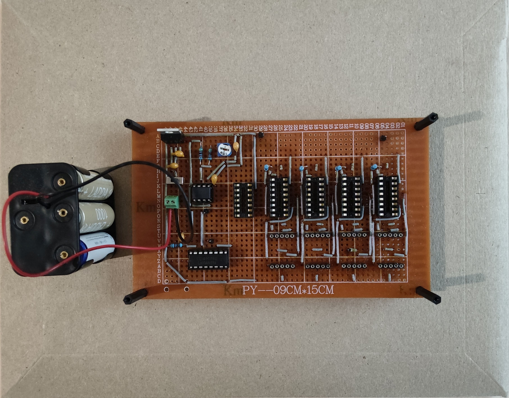
С обратной стороны:
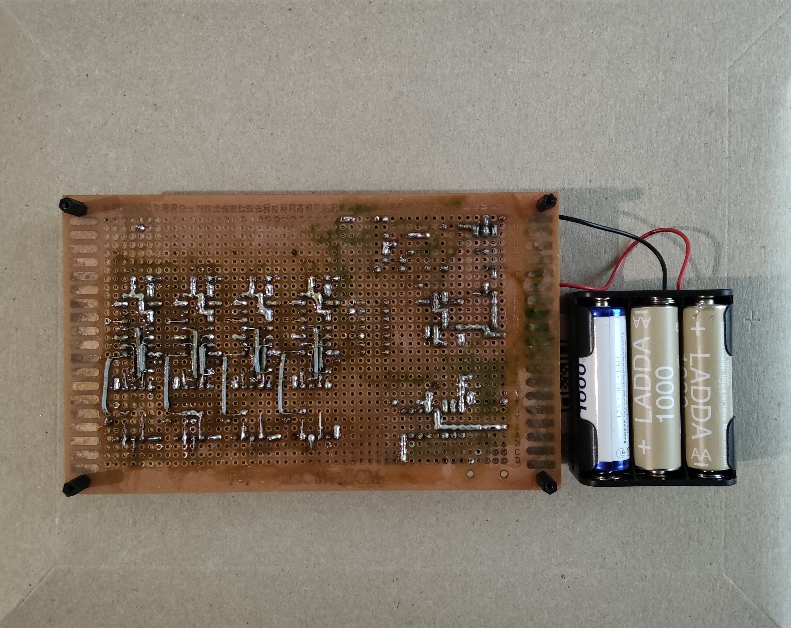
Рабочая схема на макетке:
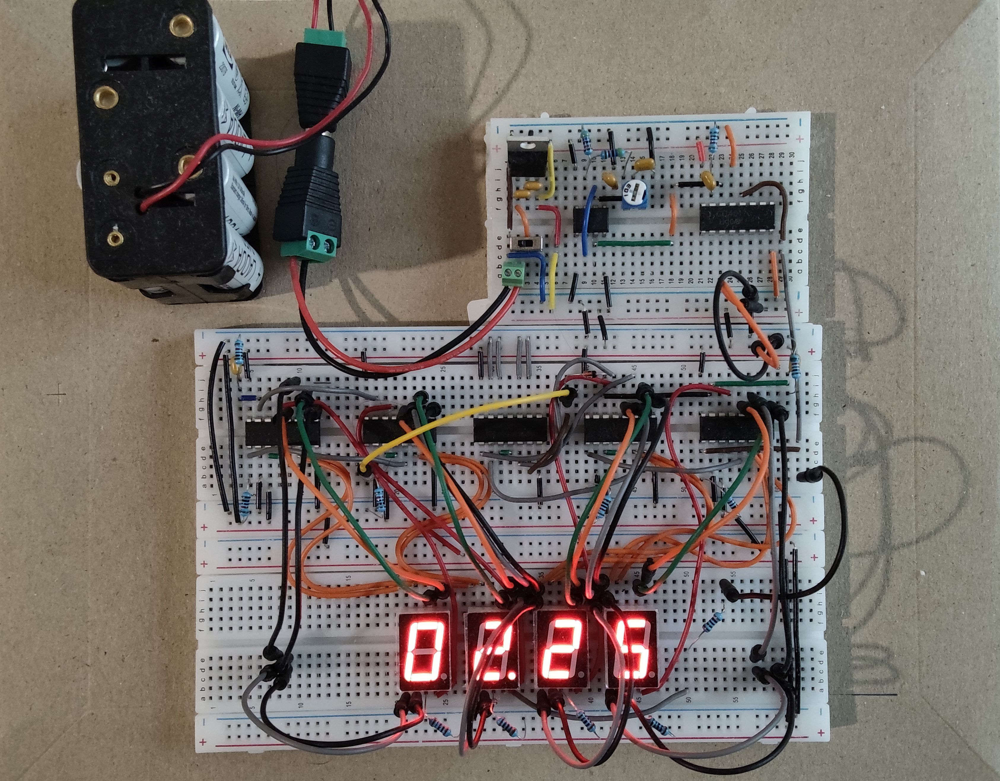
Проектирование схемы в SimulIDE:
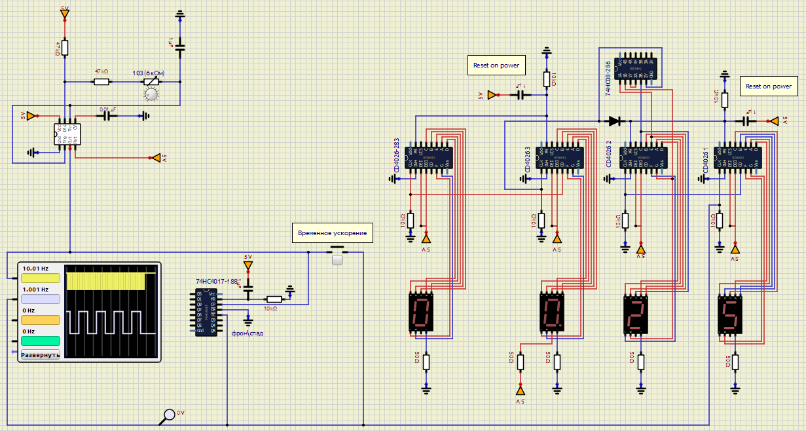
Проектирование разводки в Blender:
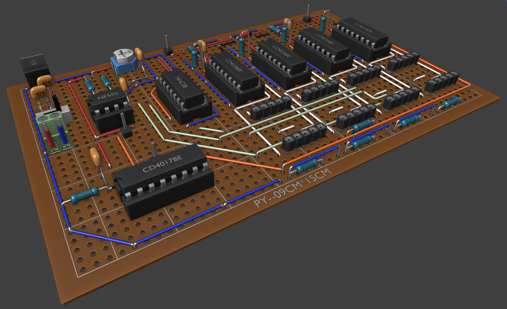
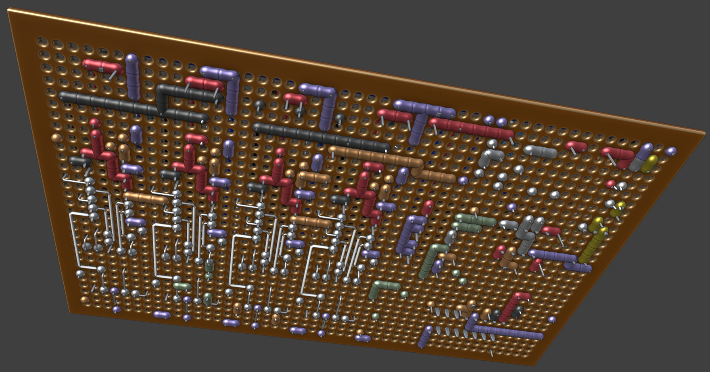

<!-- # 1C -->

<!-- ## Личный учебный проект – «Учёт расходов» -->

<!-- Учебная конфигурация для отработки работы с докумиентами, списками и регистрами.   -->
<!-- Код конфигурации – [GitHub](https://github.com/s-ly/1C_Test "Код конфигурации"). -->
<!-- 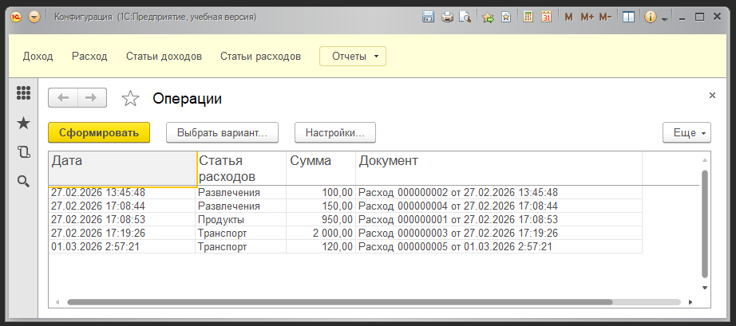 -->

# Медицинский VR-симулятор «Виртуальный пациент»
Unity проект на предыдущей работе – Медицинский VR-симулятор «Виртуальный пациент». Симулятор, обучающий навыкам работы врача-терапевта. Разработан в Unity, для создания 3D-контента использовались также Unreal Engine и Blender. Существует в двух видах - обычный для Wimdows и VR. Версия VR работает через соединение с компьютером и очками PICO. В программе реализован встроенный редактор сценариев, режим экзамена и защита от копирования. Всю работу проделал один, за исключением консультации врача, по вопросом медицины. Разработка заняла примерно 1 год. У персонажей реализована мимика, они могут говорить, речь генерируется по тексту.  

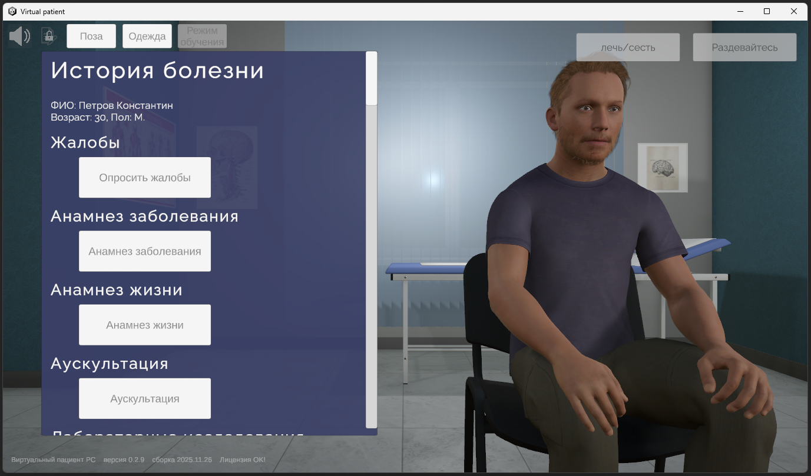  
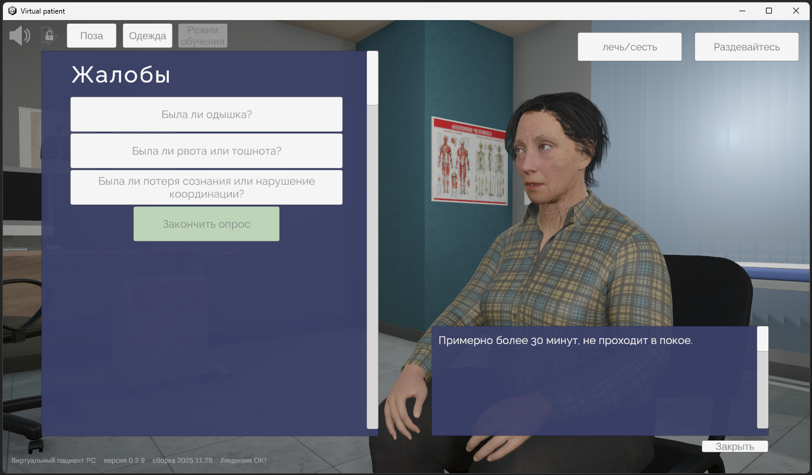  
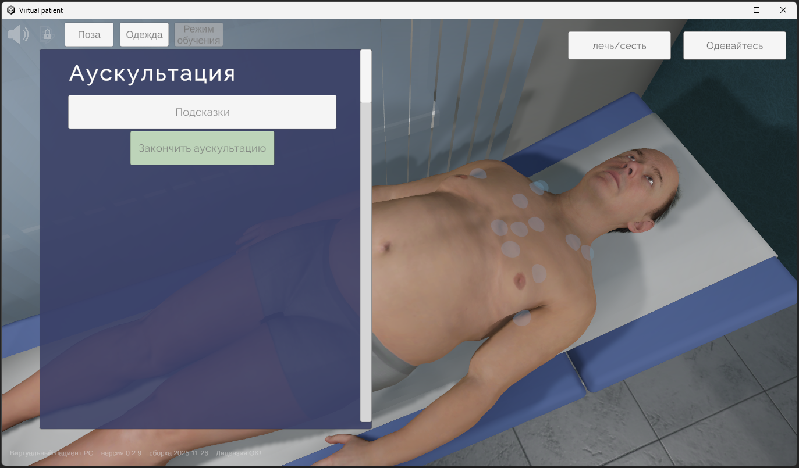  
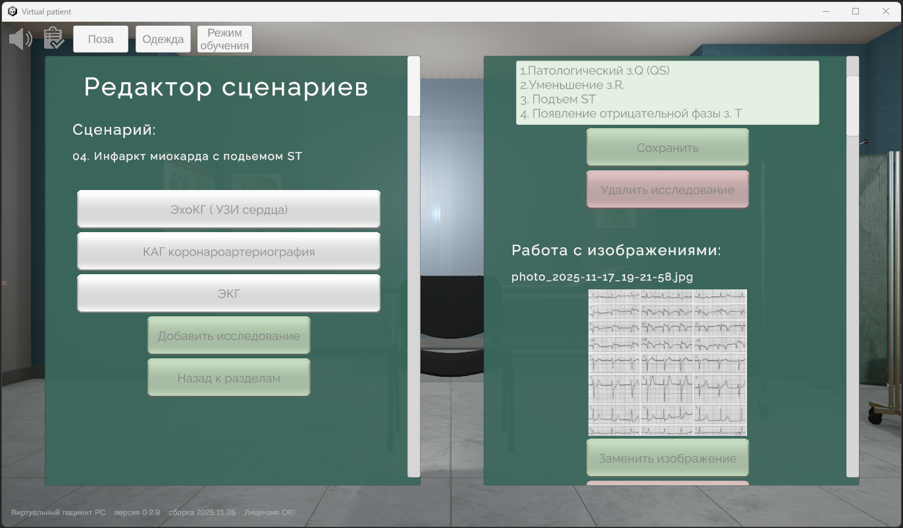  

# Симулятор УЗИ

## Проект на предыдущей работе – Медицинский VR-симулятор «Виртуальный пациент»
SonoVision - Виртуальный симулятор ультразвуковой диагностики, обеспечивающий изучение основных навыков проведения УЗИ, понимание и идентификацию различных заболеваний и патологий внутренних органов человека. Учавствовал в проекте в качестве 3D-моделлера. Основное направление - разработка сердца. Использовал Blender и сопутствующие программы для 3D., Использовал Python для автоматизации работы в Blender API.  

Все изображения с [официальной страницы проекта.](https://eidos-medicine.com/products/simulyatory-diagnostiki/sonovision/ "Симулятор УЗИ")
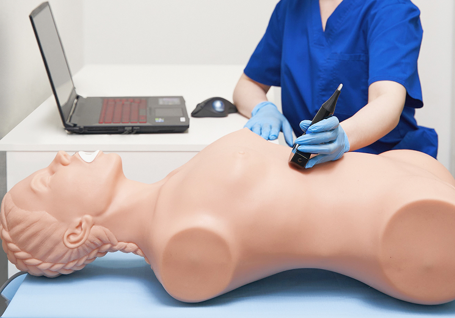  
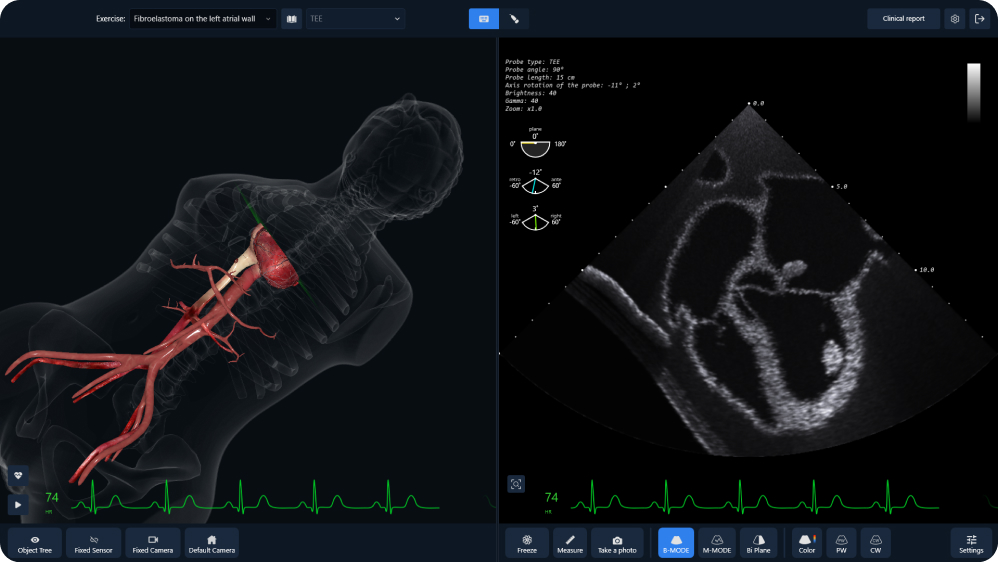  
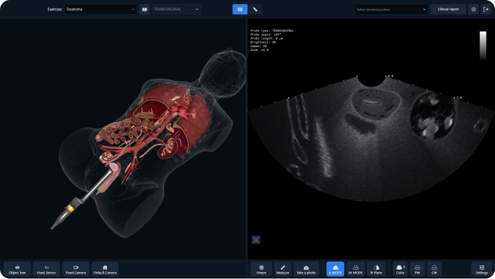  

<!--

# Личный проект Unity

## Личный проект – 3D игра «Космическая прогулка»
Игра на Unity, «Космическая прогулка», размещена в – [Яндекс Игры](https://yandex.ru/games/app/454197?draft=true&lang=ru "Играть на Яндекс Игры"). К сожалению, игру сняли с публикации, из-за малого количества игроков, поэтому, залил по новой в черновик, её нужно сильно переделать, чтобы можно было снова отправлять на модерацию. Код игры на – [GitHub](https://github.com/s-ly/SpaceWalk "Код игры").  

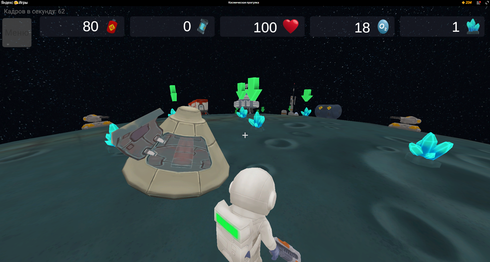  
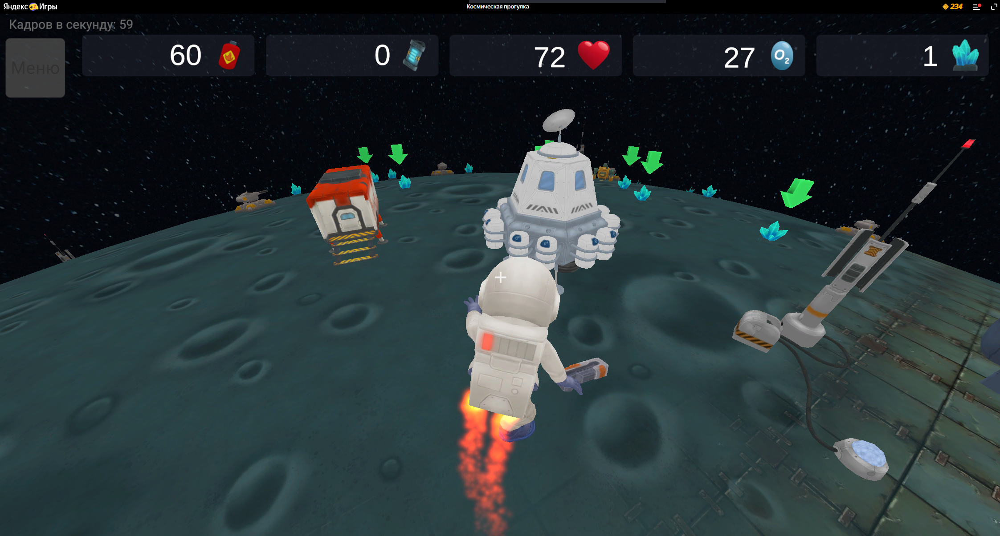
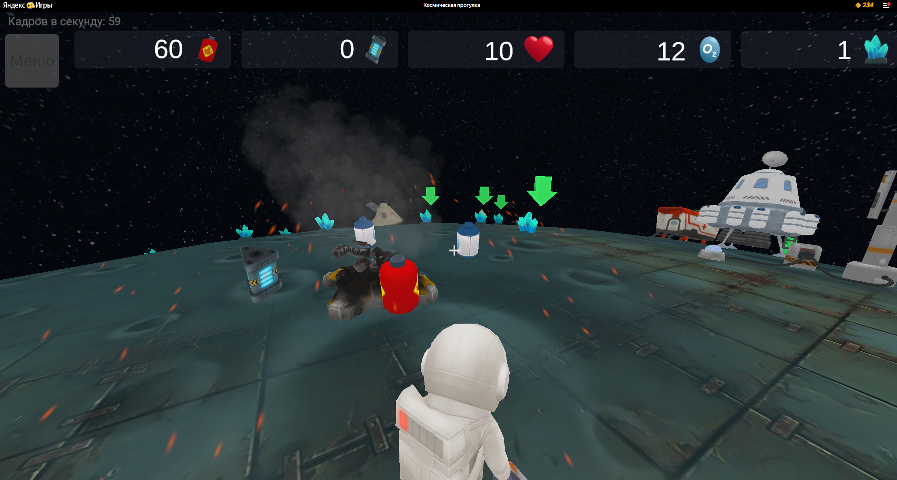

# Тестовые задания Unity

## Тестовое задание – QR-code
Сделать: Сгенерировать два QR-кода, положить их на столе и померить через приложение Юнити расстояние между двумя QR.  
Подробнее: [QR-code на GitHub](https://github.com/s-ly/QR-code "QR-code на GitHub")
  

## Тестовое задание – Гараж
Сделать: Сложить ящики в машину.  
Подробнее: [Гараж на GitHub](https://github.com/s-ly/Garage "Гараж на GitHub")
  

## Тестовое задание – Полуночный человек
Сделать: Дизайн уровня с падающей водой, которая может потушить свечку.  
Подробнее: [Полуночный человек на GitHub](https://github.com/s-ly/MidnightMan "Полуночный человек на GitHub")
  

-->

<!-- ## Hi there! 👋 -->

<!--
**s-ly/s-ly** is a ✨ _special_ ✨ repository because its `README.md` (this file) appears on your GitHub profile.

Here are some ideas to get you started:

- 🔭 I’m currently working on ...
- 🌱 I’m currently learning ...
- 👯 I’m looking to collaborate on ...
- 🤔 I’m looking for help with ...
- 💬 Ask me about ...
- 📫 How to reach me: ...
- 😄 Pronouns: ...
- ⚡ Fun fact: ...
-->
